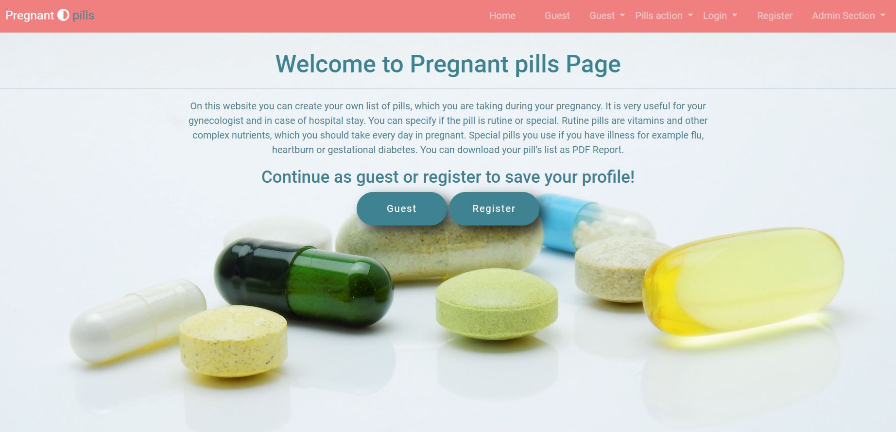
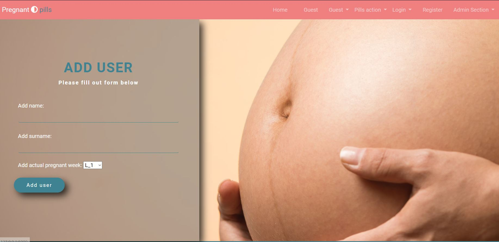
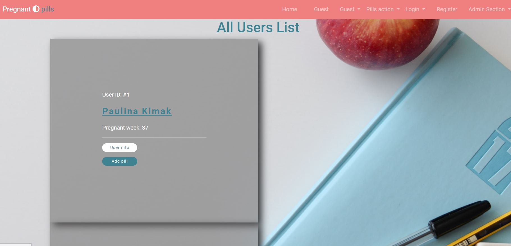

# Pregnant Pills
Pregnant Pills is a web application designed to help pregnant women track and manage medications taken during pregnancy.

The system allows users to register, maintain a personalized list of pills, categorize them, specify pregnancy week, and generate a downloadable PDF report for medical consultations.

This project demonstrates both application development (Flask) and cloud-native deployment strategies (Kubernetes on AWS).

## Table of Contents

* [Overview](#overview)
* [Architecture Focus](#architecture-focus)
* [Technology Stack](#technology-stack)
* [Previews](#Previews)
* [Deployment Strategies](#deployment-Sstrategies)
* [Deployment Variants](#deployment_variants)
* [Setup](#setup)
* [Project Status](#project-status)
* [Future Improvements](#future-improvements)
* [Contact](#contact)
* [License](#license)

## Overview

Pregnant Pills enables users to:
- Register and manage an account
- Track medications taken during pregnancy
- Categorize pills (routine / special)
- Store dosage, dates, and pregnancy week
- Generate a PDF report for medical visits

The application was originally built using Flask and SQLite, and later extended to support cloud-native deployment patterns.

## Architecture Focus

This repository is not only about a Flask application — it demonstrates:

- Infrastructure as Code (Terraform)
- Kubernetes deployment patterns
- Environment separation (dev/test/prod)
- DNS + Elastic IP management (Route 53)
- Ingress configuration
- Multiple cluster strategies (k3s, EKS, future Fargate)

The goal of the project is to evolve from a simple web application into a production-oriented, cloud-deployable system.

## Technology Stack

### Application Layer
- Python 3.11
- Flask 2.2.2
- SQLAlchemy 1.4.45
- WTForms 3.0.1
- Bootstrap 5.2.3
- SQLite (dev environment)
- PostgreSQL (test/prod environments)

### Infrastructure & Cloud
- AWS (EC2, Route 53, Elastic IP)
- Kubernetes (k3s / EKS)
- Terraform
- Kustomize
- Helm (EKS branch)
- Traefik Ingress (k3s)
- AWS Load Balancer Controller (EKS)

## Previews

### Home Page

### Register user page

### Admin page - all users

## Setup

- Clone This Project git clone
- Enter Project Directory cd Pregnant_Pills
- Create a Virtual Environment (for Windows) py -m venv (name your virtual enviroment :) venv

'EXAMPLE: py -m venv venv'

- Activate Virtual Environment source: venv/Scripts/activate
- Install Requirements Package pip install -r requirements.txt
- Finally Run The Project: python app.py

## Deployment Strategies

This project includes multiple infrastructure and deployment strategies:

### Traditional VM-based Kubernetes
- **EC2 (spot) + k3s + Kustomize** – main branch  
→[EC2 + k3s + Kustomize)](docs/deployment/1.ec2_kustomization/Deployment_Spot_EC2.md)

### Managed Kubernetes
- **EKS + Helm** – eks branch  
→ [EKS Deployment Guide](docs/deployment/2.eks_helm/Deployment_EKS_Helm.md)

### Serverless container workloads
- **(Planned) EKS + Fargate** – future extension  
→ [Serverless container workloads](docs/deployment/2.eks_helm/Deployment_Fargate.md)

Detailed documentation can be found in the `/docs/deployment` directory.

## Deployment Variants

This project demonstrates multiple Kubernetes deployment approaches:

| Variant | Infrastructure | Deployment Tool | Ingress | DNS | Scaling |
|----------|---------------|----------------|---------|------|---------|
| EC2 + k3s | Terraform | Kustomize | Traefik | Route53 | Manual / HPA |
| EKS | Terraform | Helm | ALB | Route53 | Managed Node Groups |
| Fargate (planned) | Terraform | Helm | ALB | Route53 | Serverless Pods |

## Project Status

Project is: _in progress_

The project is being expanded toward production-grade Kubernetes deployments and infrastructure best practices.

## Future Improvements

### Application

- Enforce authentication for PDF download
- Improve PDF layout and formatting
- Add role-based access (admin / user)
- Improve validation and error handling

### Infrastructure
- Horizontal Pod Autoscaler (HPA)
- Production-grade PostgreSQL (RDS)
- TLS automation (cert-manager)
- CI/CD pipeline (GitHub Actions)
- Monitoring & logging (Prometheus + Grafana)

## Contact

- Created by [@RockPiryt Github](https://github.com/RockPiryt)
- My Resume [@RockPiryt Resume](https://rockpiryt.github.io/Personal_Site/)

Feel free to contact me!

## License

This project is open source and available under the [MIT License]
